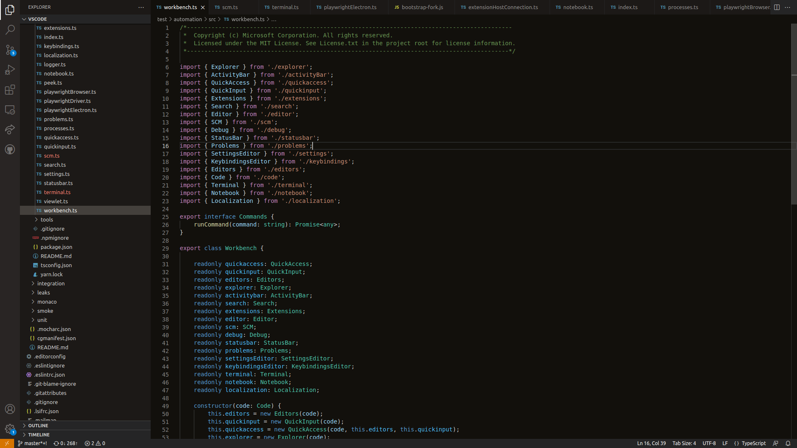
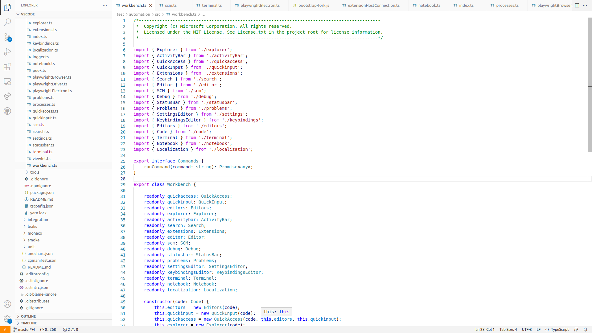

# Gitpod VS Code Theme

Gitpod Theme for VS Code

## Gitpod Dark

## Gitpod Light

## Installation

1. Open Extensions sidebar panel in VS Code. **View → Extensions**
2. Search for **Gitpod Theme**
3. Click **Install** to install it.
4. Click **Reload** to reload the editor.
5. File > Preferences > Color Theme > Gitpod Light / Gitpod Dark
